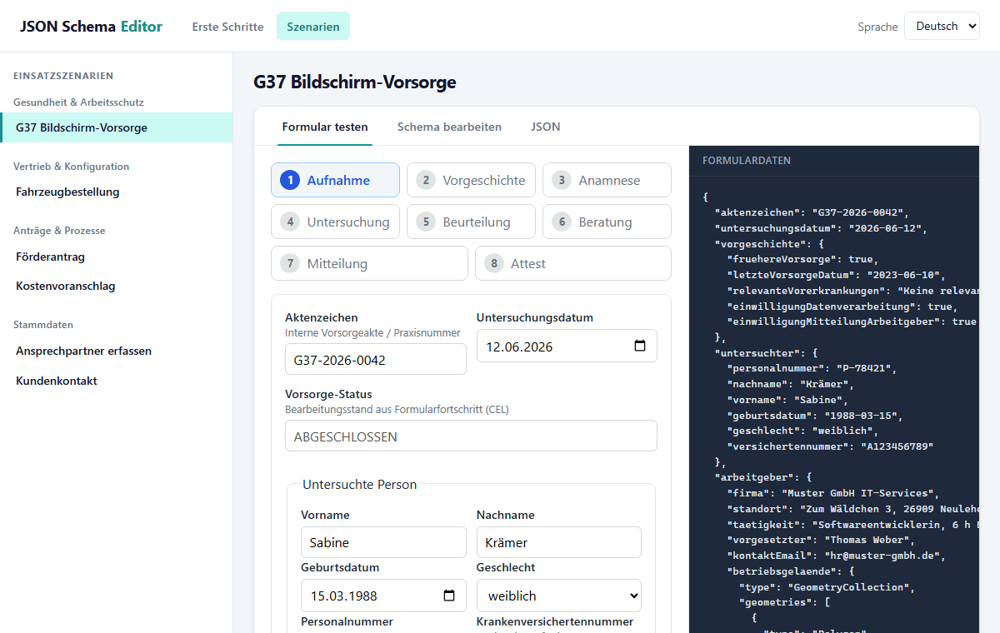

# JSON Schema Editor

[](https://github.com/eumicro/jsonschema-editor/actions/workflows/ci.yml)

**Live demo (GitHub Pages):** [eumicro.github.io/jsonschema-editor](https://eumicro.github.io/jsonschema-editor/) — Get started guide and curated scenarios.



Three **standalone npm packages** — JSON Schema and UI Schema are intentionally separate:

| Project | Package | Responsibility |
| --- | --- | --- |
| [jsonschema-editor-json-schema](./jsonschema-editor-json-schema) | `@jsonschema-editor/json-schema` | Object-oriented **JSON Schema** model |
| [jsonschema-editor-json-schema-extensions](./jsonschema-editor-json-schema-extensions) | `@jsonschema-editor/json-schema-extensions` | Format extensions, `x-values-source`, AJV helpers |
| [jsonschema-editor-ui-schema](./jsonschema-editor-ui-schema) | `@jsonschema-editor/ui-schema` | Object-oriented **UI Schema** model |
| [jsonschema-editor-vue](./jsonschema-editor-vue) | `@jsonschema-editor/vue` | Vue form editor & form |
| [jsonschema-editor-vue-extensions](./jsonschema-editor-vue-extensions) | `@jsonschema-editor/vue-extensions` | Form renderers for formats & value sources |
| [jsonschema-editor-examples](./jsonschema-editor-examples) | – | Local editor example (not published to npm) |

## Installation (npm)

```bash
# JSON Schema only
npm install @jsonschema-editor/json-schema

# UI Schema (bridge optional with JSON Schema)
npm install @jsonschema-editor/ui-schema

# Vue 3 form editor (installs json-schema + ui-schema transitively)
npm install @jsonschema-editor/vue vue

# Optional: email/url/phone fields and select lists from APIs
npm install @jsonschema-editor/json-schema-extensions @jsonschema-editor/vue-extensions
```

Same with pnpm/yarn. **Node.js ≥ 20** is required.

## End-to-end example (Vue + extensions)

A minimal contact form with typed email fields, a static dropdown, and AJV validation on blur:

```ts
// main.ts
import { createApp } from "vue";
import { install } from "@jsonschema-editor/vue";
import { documentFromJSONWithExtensions } from "@jsonschema-editor/json-schema-extensions";
import { registerDefaultVueExtensions } from "@jsonschema-editor/vue-extensions";
import { UiSchema } from "@jsonschema-editor/ui-schema/bridge";
import App from "./App.vue";
import "@jsonschema-editor/vue/style.css";

registerDefaultVueExtensions();

const app = createApp(App);
install(app);
app.mount("#app");
```

```vue
<!-- App.vue -->
<script setup lang="ts">
import { ref } from "vue";
import { JsonSchemaForm } from "@jsonschema-editor/vue";
import { documentFromJSONWithExtensions } from "@jsonschema-editor/json-schema-extensions";
import { UiSchema } from "@jsonschema-editor/ui-schema/bridge";

const schemaJson = {
  type: "object",
  properties: {
    name: { type: "string", title: "Name" },
    email: { type: "string", format: "email", title: "Email" },
    department: {
      type: "string",
      title: "Department",
      "x-values-source": { kind: "static", values: ["Sales", "Engineering"] },
    },
  },
  required: ["name", "email"],
};

const schema = documentFromJSONWithExtensions(schemaJson);
const uiSchema = UiSchema.generateForSchema(schema.root);
const data = ref({ name: "", email: "", department: "Sales" });

function onSubmit({ valid }: { valid: boolean }) {
  if (valid) console.log("Saved", data.value);
}
</script>

<template>
  <JsonSchemaForm
    :schema="schema"
    :ui-schema="uiSchema"
    v-model="data"
    validation-mode="blur"
    @submit="onSubmit"
  />
</template>
```

Use `documentFromJSONWithExtensions()` whenever the schema contains `x-format-extension` or `x-values-source`. Plain `documentFromJSON()` ignores unregistered custom attributes.

See the runnable demo in [jsonschema-editor-examples](./jsonschema-editor-examples) (`pnpm --filter jsonschema-editor-examples run dev`).


## Architecture

```
json-schema          ui-schema              vue
(OOP SchemaNode)     (OOP UiElement)        (components)
      │                    │                    │
      └──────── bridge ────┘                    │
           (optional)                           │
                └───────────────────────────────┘
```

- **No shared core package** — each model is standalone.
- The **bridge** (`@jsonschema-editor/ui-schema/bridge`) optionally connects both worlds:
  - `UiSchemaGenerator.generateForSchema()`
  - `FormDefinition.fromJSON()` for combined documents
  - `resolveSchemaAtScope()` delegates to `SchemaNode.resolveAtScope()`

## Development (monorepo)

Prerequisites: Node.js ≥ 20, [pnpm](https://pnpm.io/) ≥ 9.

```bash
pnpm install
pnpm run build
pnpm run test
pnpm --filter jsonschema-editor-examples run dev
pnpm --filter jsonschema-editor-examples run test:e2e   # Playwright
```

More details: [PUBLISHING.md](./PUBLISHING.md), [CHANGELOG.md](./CHANGELOG.md), [SECURITY.md](./SECURITY.md).

## JSON Schema (standalone)

```ts
import {
  ObjectSchema,
  StringSchema,
  documentFromJSON,
} from "@jsonschema-editor/json-schema";

// Build programmatically
const person = new ObjectSchema();
person.setProperty("name", new StringSchema(), true);

// Or load from JSON
const doc = documentFromJSON({
  type: "object",
  properties: { name: { type: "string" } },
  required: ["name"],
});
doc.root; // ObjectSchema
```

## UI Schema (standalone)

```ts
import { UiSchemaFactory } from "@jsonschema-editor/ui-schema";

const factory = new UiSchemaFactory();
const layout = factory.createVerticalLayout([
  factory.createControl("#/properties/name", "Name"),
]);
```

## Bridge (both together)

```ts
import { ObjectSchema, StringSchema } from "@jsonschema-editor/json-schema";
import { UiSchema } from "@jsonschema-editor/ui-schema/bridge";

const schema = new ObjectSchema();
schema.setProperty("title", new StringSchema(), true);
const ui = UiSchema.generateForSchema(schema);
```

## License

[MIT](./LICENSE)
