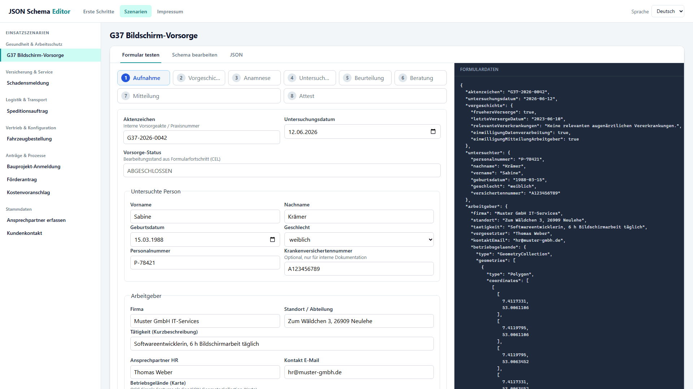

# JSON Schema Editor

[](https://github.com/eumicro/jsonschema-editor/actions/workflows/ci.yml)

**Live demo:** [jsonschema-editor.cloudapplication.net](https://jsonschema-editor.cloudapplication.net/) — Get started guide and curated scenarios (GitHub Pages).



Monorepo of **standalone npm packages** for JSON Schema, UI Schema, and form editors for **Vue 3** and **React 19**. JSON Schema (structure/validation) and UI Schema (layout/presentation) are intentionally separate.

| Project | Package | Responsibility |
| --- | --- | --- |
| [jsonschema-editor-json-schema](./jsonschema-editor-json-schema) | `@jsonschema-editor/json-schema` | Object-oriented **JSON Schema** model |
| [jsonschema-editor-json-schema-extensions](./jsonschema-editor-json-schema-extensions) | `@jsonschema-editor/json-schema-extensions` | Format extensions, `x-values-source`, `x-computed`, `x-file`, `x-geometry`, `x-rating`, `x-progress-bar`, AJV helpers |
| [jsonschema-editor-ui-schema](./jsonschema-editor-ui-schema) | `@jsonschema-editor/ui-schema` | Object-oriented **UI Schema** model |
| [jsonschema-editor-vue](./jsonschema-editor-vue) | `@jsonschema-editor/vue` | Vue 3 form editor & fillable form |
| [jsonschema-editor-vue-extensions](./jsonschema-editor-vue-extensions) | `@jsonschema-editor/vue-extensions` | Vue renderers for schema extensions |
| [jsonschema-editor-react](./jsonschema-editor-react) | `@jsonschema-editor/react` | React 19 form editor & fillable form |
| [jsonschema-editor-react-extensions](./jsonschema-editor-react-extensions) | `@jsonschema-editor/react-extensions` | React renderers for schema extensions |
| [jsonschema-editor-examples](./jsonschema-editor-examples) | – | Vue demo app (not published to npm) |
| [jsonschema-editor-examples-react](./jsonschema-editor-examples-react) | – | React demo app (not published to npm) |

## Installation (npm)

```bash
# JSON Schema only
npm install @jsonschema-editor/json-schema

# UI Schema (bridge optional with JSON Schema)
npm install @jsonschema-editor/ui-schema

# Vue 3 form editor (installs json-schema + ui-schema transitively)
npm install @jsonschema-editor/vue vue

# React 19 form editor
npm install @jsonschema-editor/react react react-dom

# Optional: email/url/phone fields, selects, computed fields, maps, file upload, rating, progress bar
npm install @jsonschema-editor/json-schema-extensions @jsonschema-editor/vue-extensions
# or for React:
npm install @jsonschema-editor/json-schema-extensions @jsonschema-editor/react-extensions
```

Same with pnpm/yarn. **Node.js ≥ 20** is required.

## End-to-end example (Vue + extensions)

A minimal contact form with typed email fields, a static dropdown, and AJV validation on blur:

```ts
// main.ts
import { createApp } from "vue";
import { install } from "@jsonschema-editor/vue";
import { documentFromJSONWithExtensions } from "@jsonschema-editor/json-schema-extensions";
import { registerDefaultVueExtensions } from "@jsonschema-editor/vue-extensions";
import { UiSchema } from "@jsonschema-editor/ui-schema/bridge";
import App from "./App.vue";
import "@jsonschema-editor/vue/style.css";

registerDefaultVueExtensions();

const app = createApp(App);
install(app);
app.mount("#app");
```

```vue
<!-- App.vue -->
<script setup lang="ts">
import { ref } from "vue";
import { JsonSchemaForm } from "@jsonschema-editor/vue";
import { documentFromJSONWithExtensions } from "@jsonschema-editor/json-schema-extensions";
import { UiSchema } from "@jsonschema-editor/ui-schema/bridge";

const schemaJson = {
  type: "object",
  properties: {
    name: { type: "string", title: "Name" },
    email: { type: "string", format: "email", title: "Email" },
    department: {
      type: "string",
      title: "Department",
      "x-values-source": { kind: "static", values: ["Sales", "Engineering"] },
    },
  },
  required: ["name", "email"],
};

const schema = documentFromJSONWithExtensions(schemaJson);
const uiSchema = UiSchema.generateForSchema(schema.root);
const data = ref({ name: "", email: "", department: "Sales" });

function onSubmit({ valid }: { valid: boolean }) {
  if (valid) console.log("Saved", data.value);
}
</script>

<template>
  <JsonSchemaForm
    :schema="schema"
    :ui-schema="uiSchema"
    v-model="data"
    validation-mode="blur"
    @submit="onSubmit"
  />
</template>
```

Use `documentFromJSONWithExtensions()` whenever the schema contains custom `x-*` attributes or extended formats. Plain `documentFromJSON()` ignores unregistered custom attributes.

Runnable demos (Vue + React, one site):

```bash
pnpm run dev:site
```

→ http://127.0.0.1:5173/ — switch stacks via the topbar **Vue | React** control.

## End-to-end example (React + extensions)

```tsx
import { useState } from "react";
import { JsonSchemaForm } from "@jsonschema-editor/react";
import { documentFromJSONWithExtensions } from "@jsonschema-editor/json-schema-extensions";
import { UiSchema } from "@jsonschema-editor/ui-schema/bridge";
import { registerDefaultReactExtensions } from "@jsonschema-editor/react-extensions";
import "@jsonschema-editor/react/style.css";

registerDefaultReactExtensions();

const schema = documentFromJSONWithExtensions({
  type: "object",
  properties: {
    name: { type: "string", title: "Name" },
    email: { type: "string", format: "email", title: "Email" },
  },
  required: ["name", "email"],
});
const uiSchema = UiSchema.generateForSchema(schema.root);

export function ContactForm() {
  const [data, setData] = useState({ name: "", email: "" });

  return (
    <JsonSchemaForm
      schema={schema}
      uiSchema={uiSchema}
      data={data}
      onDataChange={setData}
      validationMode="blur"
      onSubmit={({ valid }) => valid && console.log("Saved", data)}
    />
  );
}
```

## Internationalization (i18n)

The editor UI ships with built-in strings for **German** (`de`, default), **English** (`en`), **French** (`fr`), **Italian** (`it`), **Polish** (`pl`), **Ukrainian** (`uk`), **Russian** (`ru`), **Chinese** (`zh`), and **Japanese** (`ja`). Switch at runtime via the `locale` prop — no required `vue-i18n` peer dependency.

```vue
<JsonSchemaForm
  :schema="schema"
  :ui-schema="uiSchema"
  v-model="data"
  locale="en"
  fallback-locale="de"
/>
```

### Form field labels

JSON Schema defines `title` and `description` as **single strings** — multilingual objects are not spec-conformant. This project separates concerns:

| Layer | Multilingual? | Mechanism |
| --- | --- | --- |
| JSON Schema | One language per field | `title` / `description` as plain strings |
| UI Schema | Yes | `i18n` key on controls → message catalog |
| Editor UI | Yes | Built-in `de` / `en` messages, overridable via `messages` prop |

Label resolution order for form controls:

1. explicit `label` on the UI control
2. `i18n` key → `t(key)` from the editor/form context
3. `title` from the JSON Schema
4. scope segment as fallback

Example UI Schema control with a translation key:

```json
{
  "type": "Control",
  "scope": "#/properties/name",
  "i18n": "person.name"
}
```

Provide translations via the `messages` prop or integrate with `vue-i18n` / your own i18n library. See [@jsonschema-editor/vue README](./jsonschema-editor-vue/README.md#internationalization-i18n) for details.

## Architecture

```
json-schema          ui-schema              vue / react
(OOP SchemaNode)     (OOP UiElement)        (components)
      │                    │                    │
      └──────── bridge ────┘                    │
           (optional)                           │
                └───────────────────────────────┘
```

- **No shared core package** — each model is standalone.
- The **bridge** (`@jsonschema-editor/ui-schema/bridge`) optionally connects both worlds:
  - `UiSchemaGenerator.generateForSchema()`
  - `FormDefinition.fromJSON()` for combined documents
  - `resolveSchemaAtScope()` delegates to `SchemaNode.resolveAtScope()`

## Development (monorepo)

Prerequisites: Node.js ≥ 20, [pnpm](https://pnpm.io/) ≥ 9.

```bash
pnpm install
pnpm run build
pnpm run test
pnpm run dev:site   # Vue + React demos, one site (port 5173)
pnpm run test:e2e   # Playwright (Vue + React examples)
```

More details: [PUBLISHING.md](./PUBLISHING.md), [CHANGELOG.md](./CHANGELOG.md), [SECURITY.md](./SECURITY.md).

## JSON Schema (standalone)

```ts
import {
  ObjectSchema,
  StringSchema,
  documentFromJSON,
} from "@jsonschema-editor/json-schema";

// Build programmatically
const person = new ObjectSchema();
person.setProperty("name", new StringSchema(), true);

// Or load from JSON
const doc = documentFromJSON({
  type: "object",
  properties: { name: { type: "string" } },
  required: ["name"],
});
doc.root; // ObjectSchema
```

## UI Schema (standalone)

```ts
import { UiSchemaFactory } from "@jsonschema-editor/ui-schema";

const factory = new UiSchemaFactory();
const layout = factory.createVerticalLayout([
  factory.createControl("#/properties/name", "Name"),
]);
```

## Bridge (both together)

```ts
import { ObjectSchema, StringSchema } from "@jsonschema-editor/json-schema";
import { UiSchema } from "@jsonschema-editor/ui-schema/bridge";

const schema = new ObjectSchema();
schema.setProperty("title", new StringSchema(), true);
const ui = UiSchema.generateForSchema(schema);
```

## Contributing

See [CONTRIBUTING.md](./CONTRIBUTING.md) for setup, tests, and pull-request guidelines.

## License

[MIT](./LICENSE)
